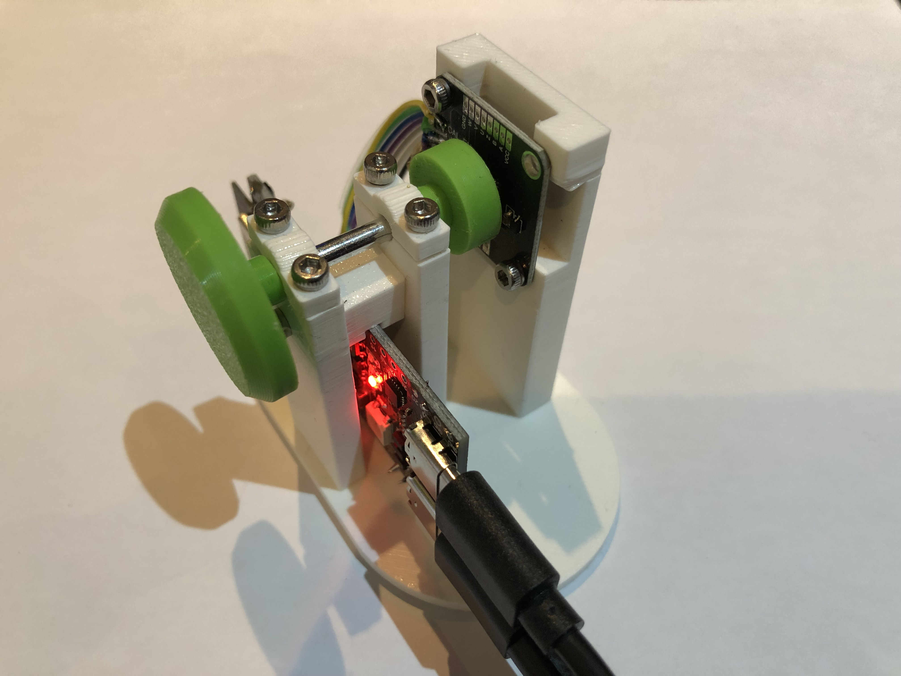
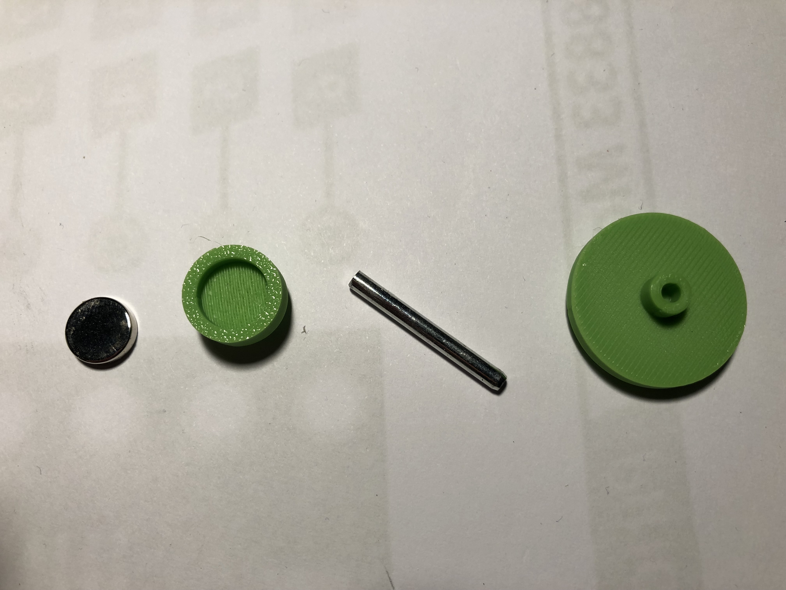

# MT6835 Angle Sensor on ESP32-S3

An Arduino sketch that reads the 21-bit absolute angle from an **MT6835** magnetic angle sensor over SPI on an **ESP32-S3**. It verifies the chip ID at startup, decodes the angle in degrees, checks the CRC, reports the sensor's status flags, and prints one reading per second to the serial port.



The axle of the testrig consists of several parts that have been press fit using a vise.



A movie of the testrig is available <a href="https://www.youtube.com/watch?v=AIi2X_5kkNY">here</a> .
The freecad 1.1 design is available in the design directory.

## Features

- Reads the 21-bit angle (about 0.00017° per step) and converts it to degrees
- Validates every sample with the sensor's CRC-8 (poly `0x07`)
- Decodes the status bits: over-speed, weak magnetic field, undervoltage
- Hardware SPI on `HSPI` (SPI3) with manual chip-select
- Automatic fallback to bit-banged SPI if the hardware path doesn't return the expected chip ID
- Step-by-step startup log that makes wiring problems easy to spot
- CRLF line endings so output displays correctly in raw terminals such as `picocom`

## Hardware

- ESP32-S3 board
- MT6835 magnetic angle sensor (breakout or custom board) with a diametrically magnetized magnet over the chip

### Wiring

| Signal        | ESP32-S3 GPIO | MT6835 pin |
|---------------|---------------|------------|
| SCK           | 1             | SCK        |
| MISO          | 12            | SDO        |
| MOSI          | 11            | SDI        |
| CS            | 6             | CSN        |
| CAL           | 7             | CAL        |
| 3.3 V / GND   | -             | VDD / GND  |

Pins are set with the `PIN_*` defines at the top of the sketch. Power the sensor so its logic levels are compatible with the ESP32-S3's 3.3 V I/O.

**CAL** is driven `LOW` by the sketch for normal run mode. `HIGH` puts the sensor into calibration mode, which this sketch never uses.

## Building and flashing

1. Install the ESP32 board package (Arduino-ESP32) in the Arduino IDE, or use PlatformIO with an ESP32-S3 environment.
2. Select your ESP32-S3 board.
3. Open the sketch, then build and upload it. No third-party libraries are needed; it only uses the built-in `SPI` library.

## Viewing the output

Open a serial terminal at **115200 baud**. For example, with `picocom` (the port name will vary on your system):

```
picocom -b 115200 /dev/ttyACM0
```

Sample output (illustrative):

```
=== MT6835 angle sensor on ESP32-S3 ===
[1/6] Serial @ 115200 baud ready
[2/6] pins: CAL=7 MISO=12 MOSI=11 SCK=1 CSN=6
      CAL -> LOW (run mode)
[3/6] SPI begin (HSPI/SPI3, MODE0, manual CS)
[4/6] reading ID register (settle + retry)
      +100 ms  ID=0x31 (match)
[5/6] hardware SPI path OK (bit-bang not needed)
[6/6] MT6835 ID = 0x31 (expect 0x31) -> detected
---- ready, sampling every 1 s ----
123.456 deg  [ok]

123.457 deg  [ok]
```

Each reading is printed as `<angle> deg  [<quality>]`. The quality field is one of:

| Quality        | Meaning                                                   |
|----------------|-----------------------------------------------------------|
| `ok`           | CRC matches and no status flags are set                   |
| `crc-fail`     | The CRC computed over the angle bytes doesn't match       |
| `over-speed`   | Status bit 0: shaft is rotating too fast for the sensor   |
| `weak-field`   | Status bit 1: magnetic field too weak (check magnet gap)  |
| `undervoltage` | Status bit 2: supply voltage too low                      |

Multiple flags can appear together, separated by spaces.

## How it works

### Startup sequence

1. Start serial at 115200 baud.
2. Print the pin map and drive CAL low.
3. Initialise `HSPI` with `SCK/MISO/MOSI` and no hardware CS (`ss = -1`); CS is toggled manually.
4. Read the ID register (`0x01`) up to 6 times, waiting 100 ms, 200 ms, ... 600 ms before each attempt, and stop as soon as it returns `0x31`.
5. If the hardware path never returns `0x31`, switch to bit-banged SPI and try once more.
6. Print the final detection result and start sampling.

### SPI transaction

Register reads use SPI mode 0 at 2 MHz with a 3-byte frame: `0x30, <register>, 0x00`. The register value is the third byte clocked back from the sensor. Chip select is asserted manually, with short delays around it.

The sketch deliberately does not let the SPI peripheral own CS: on the wiring this was written for, doing so left MISO floating.

### Registers used

| Address | Name | Description                                     |
|---------|------|-------------------------------------------------|
| `0x01`  | ID   | Chip ID, expected `0x31`                        |
| `0x03`  | A3   | Angle bits 20..13                               |
| `0x04`  | A2   | Angle bits 12..5                                |
| `0x05`  | A1   | Angle bits 4..0 (upper bits) and status (low 3) |
| `0x06`  | CRC  | CRC-8 over A3, A2, A1                           |

### Angle decoding

```
raw     = (A3 << 13) | (A2 << 5) | (A1 >> 3)      // 21-bit value
degrees = raw / 2^21 * 360
status  = A1 & 0x07                               // bit0 over-speed, bit1 weak-field, bit2 undervoltage
```

The CRC is CRC-8 with polynomial `0x07`, initial value `0x00`, MSB-first, no reflection and no final XOR, computed over `A3, A2, A1`.

## Configuration

| Define          | Default     | Purpose                                             |
|-----------------|-------------|-----------------------------------------------------|
| `PIN_CAL`       | `7`         | Calibration-mode select (kept low)                  |
| `PIN_MISO`      | `12`        | SPI data from sensor                                |
| `PIN_MOSI`      | `11`        | SPI data to sensor                                  |
| `PIN_SCK`       | `1`         | SPI clock                                           |
| `PIN_CS`        | `6`         | Chip select (manual)                                |
| `MT_ID_DEFAULT` | `0x31`      | Expected chip ID                                    |
| `SPI_FREQ`      | `2000000`   | Hardware SPI clock in Hz (500 kHz to 2 MHz tested)  |

The sampling interval is fixed at 1 s in `loop()`.

## Troubleshooting

- **`ID=0xFF` or `0x00` on every attempt**: check wiring, especially MISO and CS, and confirm the sensor is powered. If the hardware path fails, the sketch retries with bit-banged SPI automatically; look at the `[5/6]` line to see which path is in use.
- **`weak-field`**: adjust the distance or alignment between the magnet and the chip.
- **Occasional `crc-fail` while the shaft is moving**: the four registers are read in separate SPI transactions, so a fast-moving shaft can produce a sample whose bytes come from slightly different positions. Such samples are flagged rather than silently accepted. A single burst read of the angle registers, if your datasheet revision supports it, would avoid this.
- **Garbled or staircased terminal output**: make sure your terminal is set to 115200 baud. Lines are terminated with `\r\n` for raw terminals.

## Limitations

- Read-only: the sketch does not write to sensor registers or EEPROM, and does not perform calibration.
